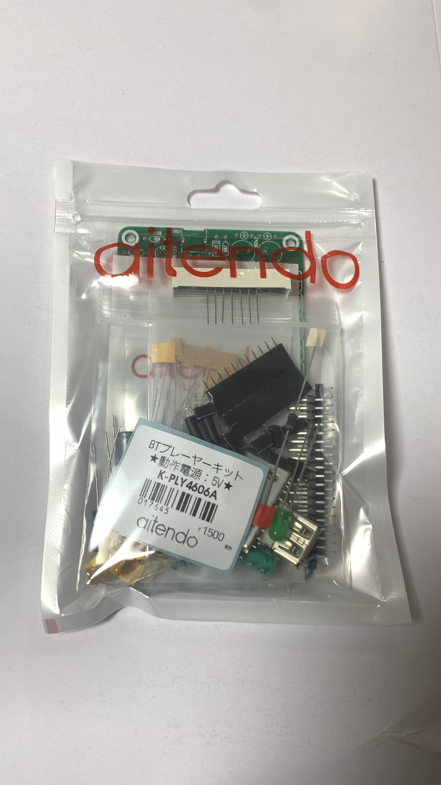
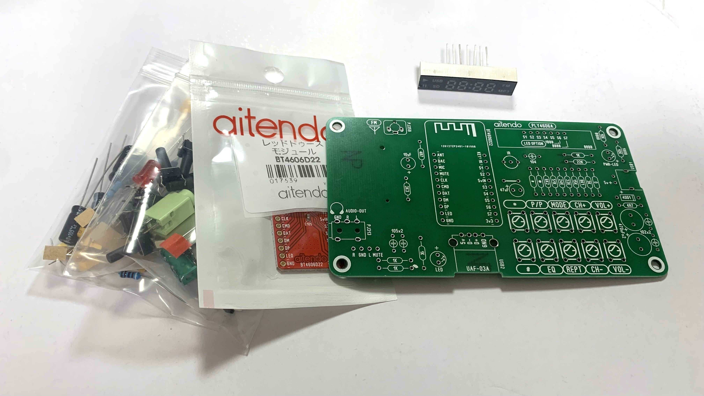
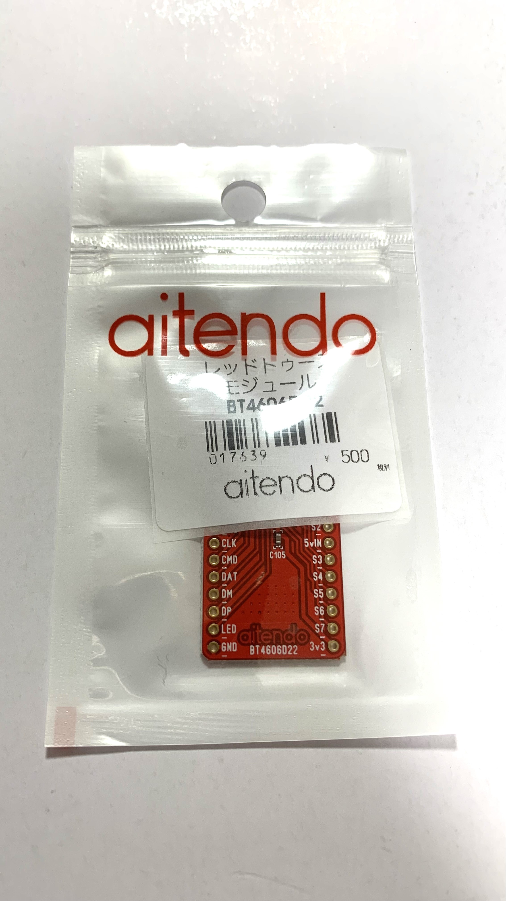
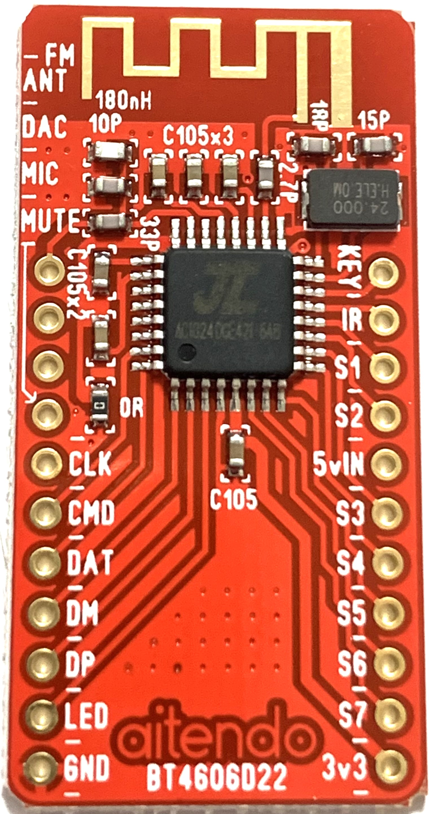
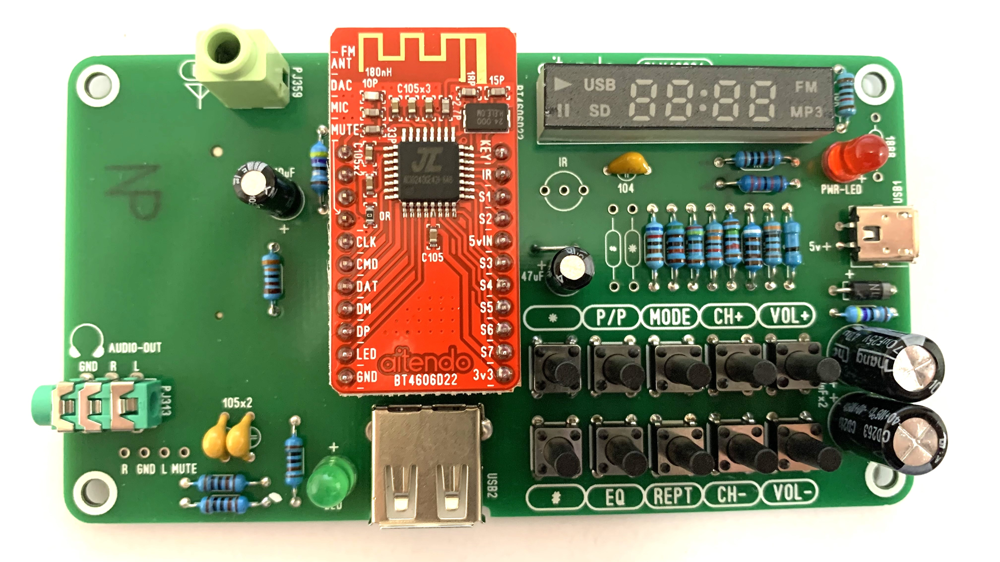
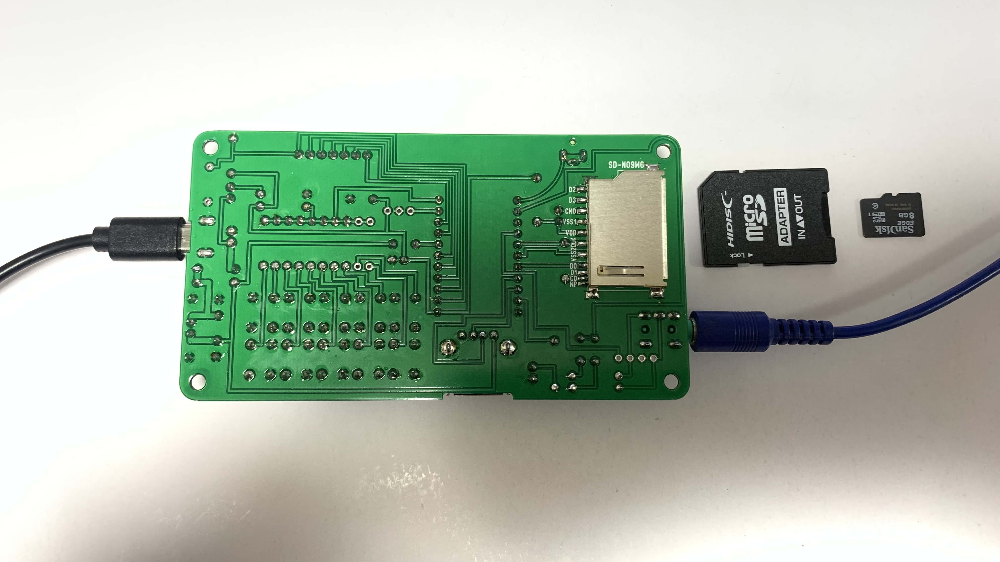

# Aitendo K-PLY4606A

[Review](#review) 
[Specifications](#specifications)

## Review

While searching for AC4601 datasheet on the internet, I came across this product. 
[Redtooth Module BT4606D22](https://www.aitendo.com/product/17639) 
Also, I found a kit which comes with this module. 
[BT Player Kit K-PLY4606A](https://www.aitendo.com/product/17645)

It's kinda funny that the product is named "Redtooth" rather than "Bluetooth". 

Anyway, before ordering, I was thinking that the module has AC4601, but it wasn't.
The chip on module has only 32 pins, rather than 48pins.
So I googled for product number and I found a blog reviewing the kit.
After reading it, I started to believe the chip is AC4606A.
So I ordered the kit and after a couple of days, I received the product. 

After unpacking, it revealed all the components. 
 
"Redtooth Module" 
 
 
Yes, the chip has marking of "AC1824DGE421-6A8".
It's AC4606A.

After assembling, the kit looks like this. 

Okay, so I connected speaker and powered the board from phone charger, I heard that familiar voice.

"The Bluetooth twice is ridi too pell"

I also heard some terrible interference noise coming from Bluetooth.
My speaker works on battery so there is no ground loop, but it's still terrible.
But anyway, I grabbed my phone, opened Bluetooth settings, and it appeared as BT_BOX.
I connected to it and...

"The Bluetooth twice, as connectee-dah successfully."

Interference noise is quite terrible, but on the other hands, music playback is working well.
It even doesn't disconnect or malfunction.

Next, I pressed the mode button and...

"The radio modal"

The interference noise significantly decreased, but it's still hererable.
By connecting normal audio cable to antenna port and long pressing play/pause button, it started searching for FM station and picked up a few stations.
Radio functionality is also working fine, although this firmware doesn't support some radio frequencies in my country, but hardware itself seems to support them.
Maybe I alter supported frequency range in future.

Next, I connected my USB flash drive and...

"Music play modal"

I heard the voice as always and it started some music stored in my USB drive.
I also tested for SD card and it works fine, but the board has bigger or normal sized SD card slot rather than microSD so I had to grab my SD card adapter. 

At music play mode, I can use the EQ functionality to change sound quality.
It is not supported on other mode like Bluetooth or radio.

At last, I disconnected all the peripherals except for speaker, and finally, I connect it to my computer via USB Male to Male cable.
It recognised as "JieLi AC46" at audio devices, and as "BT15 DEVICE V1.00 USB Device" at disk drives.
By switching output device to JieLi AC46, I can use the kit as USB-DAC.
But that is not the goal for this time, I want to do is of course, dumping.
I will write about dumping and reverse engineering on main markdown.

## Specifications
- Main MCU: AC4606A
- Bluetooth Version: Bluetooth 2.1+EDR
- Features: Bluetooth playback, USB Flash Drive, SDCard, FM Radio, USB-DAC
- FM Frequency Range: 87.5-108MHz (Chip itself seems to support 76.0-108MHz)
