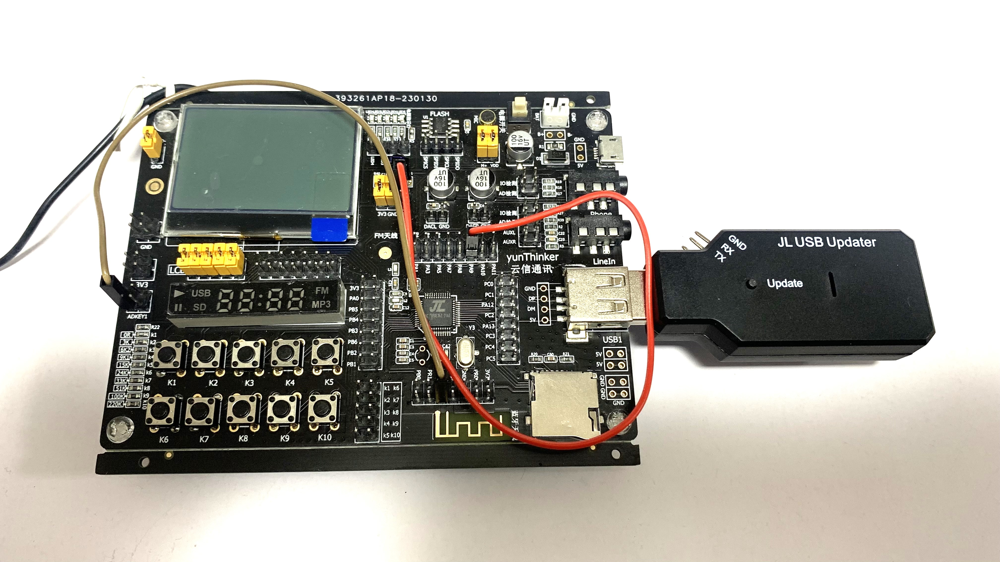

# Information about JieLi AC46/BT15 Reverse Engineering
A record of reverse engineering by noob 
Special thanks to [kagaimiq](https://github.com/kagaimiq)  

## Table of Contents

[Discovery of tools and informations](#discovery-of-tools-and-informations) 
[Beginning of reverse engineering](#beginning-of-reverse-engineering) 
[Reverse Engineering Part 1](https://github.com/0x0-nyan/JL_AC46/blob/main/ReverseEngineering1.md) 
[Reverse Engineering Part 2](https://github.com/0x0-nyan/JL_AC46/blob/main/ReverseEngineering2.md) 
[Reverse Engineering Part 3](https://github.com/0x0-nyan/JL_AC46/blob/main/ReverseEngineering3.md) (Jump Here For Latest Information) 
## Discovery of Tools and Informations

Recently, I found these rather interesting tools and forum about JieLi.

[jl-uboot-tool](https://github.com/kagaimiq/jl-uboot-tool) 
[jl-misctools](https://github.com/kagaimiq/jl-misctools) 
[USMI Forum](https://usmi.mybb.ru/viewtopic.php?id=4)

Although I don't have any knowledge about python, but I immediately downloaded tools and installed IDE, and other requirements anyway. 
So I ran the UBoot tool and tried to dump firmware from a few devices with JieLi chip, but for some reason, it doesn't work well.
But I tried dumping from AC6921A development board with JL Downloader dongle, it worked well.

On the other hands, I also tried the firmware unpacker and it successfully unpacked.
So I started googling "jl_690x.bfu", downloading BFU file, removing BFU header and pushing into unpacker.
Most of firmwares I downloaded could unpacked successfully, but some of them seem to have different structure.

## Beginning of Reverse Engineering

A few days later, I was having a look at USMI forum, then I found another tool called JLDFUTool.
I downloaded it and tried to dump from my Chinese Bluetooth Speaker called WS-2015, and yes!
It could dump firmware, but there were some CRC mismatch too.

(I don't care such lil thing, I wanna unpack it now!)

I have a toolchain for AC46, which has DV10 compiler, so firstly I pushed dump into fwunpack_dv.py, but it said SYD header CRC mismatch.
So I tried 690x one, and even the new firmware one, but nothing worked well except for old generation stuff, called sydtools.
I didn't know what is the SYD, but I was about to understand what it is, and why the dedicated unpacker doesn't work.

(Continue to [Reverse Engineering Part 1](https://github.com/0x0-nyan/JL_AC46/blob/main/ReverseEngineering1.md))
