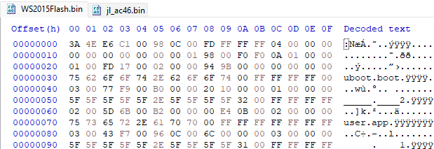
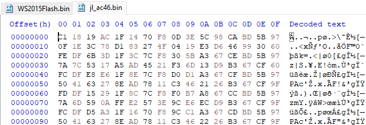

# Reverse engineering of AC46/BT15 Part 1

By having a look at dumped AC46 firmware(WS2015Flash.bin) using binary editor, there is a file list which is not encrypted.<br>
<br>


But there were some problems.

What the each bytes actually mean?<br>
Another AC46 firmware has encrypted file list, how do I decrypt?<br>


Well, no problem.
Because I found this.

[jielie](https://github.com/kagaimiq/jielie)

This awesome repo gave me a lot of information about JieLi chip and firmware.
For detail about file list, I definitely recommend checking this: [jielie#SDFILE / SYDFS](https://github.com/kagaimiq/jielie/blob/main/datafmt/sdfile.md)<br>
I learned about file list from it and read the information from binary, and wrote down this.

```list
           Raw Data      Detail
****************************************
Type:      0x01          uboot.boot
CRC:       0x17FD        -
Offset:    0x200         -
File Size: 0x9B94        39828Bytes
Index:     0x00          0
File Name: uboot.boot    -
****************************************
Type:      0x03          Additional
CRC:       0xF977        -
Offset:    0xB000        -
File Size: 0x1020        4128Bytes
Index:     0x01          1
File Name: _____.____2   -
****************************************
Type:      0x02          user.app
CRC:       0x6B5D        -
Offset:    0xB200        -
File Size: 0xBE400       779264Bytes, end at 0xC9600
Index:     0x02          2
File Name: user.app      -
****************************************
Type:      0x03          Additional
CRC:       0xF743        -
Offset:    0xC9600       -
File Size: 0x6C          108Bytes
Index:     0x03          3
File Name: _____.____1
****************************************
```

By the way, another firmware file which I grabbed from AC46_BT_SDK has encrypted file list.
So I made a tiny program powered by JieLi cipher library from jl-misctools, and I successfully decrypted the list.
(I don't know about Python, it was bit difficult for me ._.)
I will upload the code somedaysദി^. _ .^)

Anyway, let's go back to about WS-2015's firmware.<br>
Based on top level file list, I extracted some files manually, but I found another files which are seemingly not listed in flash header or additional file list like _____.____2. (Should be listed somewhere, probably in user.app or other encrypted area, or maybe I'm decrypting in wrong way)<br>
Also, I noticed a few strange things while looking at _____.____2.

First thing is size of _____.____2 and offset of user.app are overlapping.<br>
_____.____2 starts at 0xB000 and ends at 4128 or 0x1020 bytes ahead which is offset 0xC010, while the user.app starts at 0xB200.<br>
Which means _____.____2 contains first 3616 or 0xE20 bytes of user.app.<br><br>

Second thing is file header format in _____.____2 is different compared to normal file header.
Usually, the file header is formatted like this:<br>
```
01 00 FD 17 00 02 00 00 94 9B 00 00 00 00 00 00   |..ý.....”›......|
75 62 6F 6F 74 2E 62 6F 6F 74 00 FF FF FF FF 00   |uboot.boot.ÿÿÿÿ.|
```
```01```: File type in UInt8: ```0x01``` (uboot.boot)<br>
```00```: Reserved<br>
```FD 17```: File CRC in UInt16: ```0x17FD```<br>
```00 02 00 00```: File offset in UInt32: ```0x200```<br>
```94 9B 00 00```: File size in UInt32: ```0x9B94```<br>
```00 00 00 00```: Index in UInt32: ```0x00```<br>
```75 62 6F 6F 74 2E 62 6F 6F 74 00 FF FF FF FF 00 ```: File name in char: ```uboot.boot``` (Null terminated)

 On the other hands, file header thingy in _____.____2 is formatted like this:<br>
```
5D 6B 43 F7 00 96 0C 00 00 00 00 14 00 00 00 00   |]kC÷.–..........|
00 00 00 00 00 FF FF FF FF FF FF FF FF FF FF FF   |.....ýýýýýýýýýýý|
(FF continues until user.app starts)              |ýýýýýýýýýýýýýýýý|
```

```5D 6B```: CRC of user.app in UInt16: ```0x6B5D```<br>
```43 F7```: CRC of _____.____1 in UInt16: ```0xF743```<br>
```00 96 0C 00```: Offset of _____.____1 in UInt32: ```0xC9600```<br>
```14```: Unknown, maybe I have to read as ```00 00 00 14``` or something else<br>
Apparently, there are no file names listed, and this is the only thing _____.____2 has, rest are filled with FF, except for overlapping section with user.app.

But anyway, I drew the flash file structure roughly, which looks like this.
```
--------------------------------0x00
       Flash/File Header
--------------------------------0xA0
--------------------------------0x200

           uboot.boot

--------------------------------0x9D94
--------------------------------0xA000
           (unknown)
          ac46btcf.bin
--------------------------------0xA051
--------------------------------0xB000
          _____.____2
--------------------------------0xB200(overlap)
---- - ---- - ---- - ---- - ----0xC010(_____.____2 ends here)
  user.app (not unpacked yet,
   I don't know what inside)

      (sdram.app should
      be placed on top)
			
        (eq_cfg.bin)
			
     (tone files, etc...)
   
--------------------------------0xC9600
          _____.____1
--------------------------------0xC966B
--------------------------------0xC9680
          chip_key.bin
   extra data for chip_key.bin
--------------------------------0xC96C0
--------------------------------0xC9800

          (unknown)

--------------------------------

(Detailed actual file list)
****************************************
Type:      0x01          uboot.boot
CRC  :     0x17FD        -
Offset:    0x200         -
File Size: 0x9B94        39828Bytes
Index:     0x00          0
File Name: uboot.boot    -
****************************************
(Headerless)
CRC:       0x85FB        -
Offset:    0xA020        -
File Size: 0x31          49Bytes
File Name: ac46btcf.bin  -
****************************************
Type:      0x03          Additional
CRC:       0xF977        -
Offset:    0xB000        -
File Size: 0x1020        4128Bytes
Index:     0x01          1
File Name: _____.____2   -
****************************************
Type:      0x02          user.app
CRC:       0x6B5D        -
Offset:    0xB200        -
File Size: 0xBE400       779264Bytes
Index:     0x02          2
File Name: user.app      -
****************************************
Type:      0x03          Additional
CRC:       0xF743        -
Offset:    0xC9600       -
File Size: 0x6C          108Bytes
Index:     0x03          3
File Name: _____.____1
****************************************
(Headerless)
CRC:       0x9281        -
Offset:    0xC9680       -
File Size: 0x20          32Bytes, extra 32Bytes after this
File Name: chip_key.bin  -
****************************************
```		
I have to take a rest probably, I will upload about new device comes with another AC46.

[(Continue to Part 2)](https://github.com/0x0-nyan/JL_AC46/blob/main/ReverseEngineering2.md)
