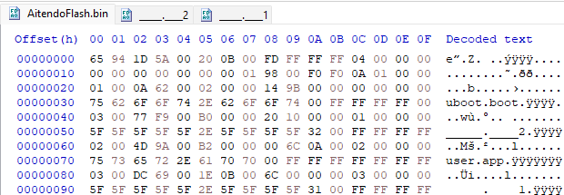

## Reverse Engineering of AC46/BT15 Part 2

A few days ago, I received and assembled the kit which comes with another AC46 chipset.<br>
For review and specification, please click the link below.

[Aitendo K-PLY4606A](Aitendo/index.md)

By connecting the kit to my computer via male to male USB cable, it recognised as audio device and disk drive.
After running JLDFUTool, I got some error, but in the end it successfully dumped the flash.
```
>jldfutool \\.\E: Aitendo
JL dumper! for AC69XX. by kagaimiq // Mizu-DEC
compiled Dec 10 2021 - 23:11:01
-------- Get chip type and load loader if neccessary! ---------
Inquiry-> [BT15    ] [ DEVICE V1.00   ] [1.00]
------------- Get Device Info -------------
failed to do IOCTL_SCSI_PASS_THROUGH_DIRECT ioctl - 121 (The semaphore timeout period has expired. )
[jlUsbIsd_GetDeviceStatus] failed to do the command fc:0a!
failed to get device status!

>jldfutool \\.\E: Aitendo
JL dumper! for AC69XX. by kagaimiq // Mizu-DEC
compiled Dec 10 2021 - 23:11:01
failed to open scsi device `\\.\E:` - 2 (The system cannot find the file specified. )
failed to open deivce `\\.\E:`.

>jldfutool \\.\D: Aitendo
JL dumper! for AC69XX. by kagaimiq // Mizu-DEC
compiled Dec 10 2021 - 23:11:01
-------- Get chip type and load loader if neccessary! ---------
Inquiry-> [BT15    ] [UBOOT2.00       ] [1.00]
------------- Get Device Info -------------
command failed - 2
[jlUsbIsd_GetFlashPageSize] failed to do the command fc:14!
failed to get max flash page size! using default 512 bytes
Device type =3, Device ID =5e4014, Chip key =a42f
The user.app encryption key is 0000 i guess...
-------------- Try This! --------------
CRC16 of header [4b9a] and the calculated one [38e2] doesn't match!
-------------- Let's Dump! --------------
====> Calced flash size = 1048576 (1024 KB)
----------------- Reset chip! ---------------
failed to do IOCTL_SCSI_PASS_THROUGH_DIRECT ioctl - 121 (The semaphore timeout period has expired. )
[jlUsbIsd_Reset] failed to do the command fc:0c!
```

As always, I pushed the dump into hex editor and raw flash/file header appeared.<br>
<br>
And as I excepted, there is a overlap between _____.____2 and user.app.
But anyway, like I did before, I extracted some files manually.<br>
```
Desc       Raw Data      Detail
****************************************
Type:      0x01          uboot.boot
CRC  :     0x620A        -
Offset:    0x200         -
File Size: 0x9B14        39700Bytes
Index:     0x00          0
File Name: uboot.boot    -
****************************************
Type:      0x03          Additional
CRC:       0xF977        Actual CRC:AF2E
Offset:    0xB000        -
File Size: 0x1020        4128Bytes
Index:     0x01          1
File Name: _____.____2   -
****************************************
Type:      0x02          user.app
CRC:       0x9A4D        Actual CRC:3758
Offset:    0xB200        -
File Size: 0xA6C00       683008Bytes
Index:     0x02          2
File Name: user.app      -
****************************************
Type:      0x03          Additional
CRC:       0x69DC        Actual CRC:5E2C
Offset:    0xB1E00       -
File Size: 0x6C          108Bytes
Index:     0x03          3
File Name: _____.____1
****************************************
```
Actually, I noticed that listed CRC doesn't match to actual CRC except for uboot.boot.
This is probably because of encryption, but there is one more strange thing.
The listed CRC of _____.____2 is same as WS-2015's one and even the SDK's one.
Maybe this is not a CRC, it meaning something different.
It's embarrassing that I didn't check the CRC before though...

Anyway, at this point, I can say that this strange structure is normal for AC46 firmware.
I've seen different 3 firmware files and all of them have this structure.
Although the file took from SDK is more encrypted, but it still seems to have a same structure.
I guess it's for security against reverse engineering like this, since it can be public for firmware update through BFU file, while flash image usually doesn't be public and cannot be dumped without expertise.

And for now, this is the end of this markdown.
There are more things to be investigated, and it's ongoing.
