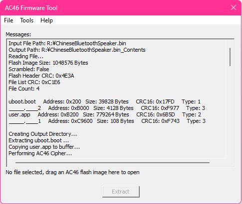

# Reverse Engineering of AC46/BT15 Part 3 : Cipher

**Hello again, I'm finally back.**<br>
In 23 November, after a many months of blank from last update, I finally got a motivation to resume reverse engineering of AC46.<br>
I implemented a few cipher functions based on firmware related stuff included in [jl-misctools](https://github.com/kagaimiq/jl-misctools) (Credit to kagaimiq), and I've managed to decrypt user.app.
By mergeing those functions and file I/O functions, as well as GUI functions and procs, I've finally made a proper tool to unpack AC46/BT15 firmware.<br>
It's not perfect yet as some mysteries are still being investigated, but it's usable.<br>
Here's a link to the tool.<br>

- [AC46 Firmware Tool](https://github.com/0x0-nyan/AC46-Firmware-Tool)<br>
<br>

By the way, I still couldn't get familiar with Python, because it 'bites' me in unexpected way.


## Cipher used in AC46 Firmware
I should call it **"AC46 Cipher"**.<br>
It is similar to SFC cipher, but unlike AC69's one, key changes by every 1024 (or 0x400) bytes.<br>
The key used here is not a chip key, in fact it is 8 basic keys, which are 0x0500, 0x0700, 0x0500, 0x0B00, 0x0D00, 0x0F00, 0x0D00, 0x0B00 each and those seem to be getting some bitwise operation.<br>
Here's how key changes.<br>
```
Key:       Address:
0x0500     address 0x000
0x0700     address 0x400
0x0500     address 0x800
0x0B00     address 0xC00
0x0D00     address 0x1000
0x0F00     address 0x1400
0x0D00     address 0x1800
0x0B00     address 0x1C00

0x0500     address 0x2000
0x0700     address 0x2400
0x0500     address 0x2800
0x1B00     address 0x2C00
0x1D00     address 0x3000
0x1F00     address 0x3400
0x1D00     address 0x3800
0x1B00     address 0x3C00

0x0500     address 0x4000
0x0700     address 0x4400
0x0500     address 0x4800
0x0B00     address 0x4C00
...        ...
```

To meet this I tried with this simple method which consists of some modulus, bitwise, and ternary operators.<br> 
```
u16 KeyArray[8] = { 0x0500, 0x0700, 0x0500, 0x0B00, 0x0D00, 0x0F00, 0x0D00, 0x0B00 };
Key = KeyArray[(i / 0x0400) % 8] | (((i / 0x0400) % 8) > 2 ? (i / 0x2000) % 2 ? (i / 0x2000) << 12 : 0 : 0);
```
However this didn't entirely work because key changes in unexpected way, like 0x0*** -> 0x1*** -> 0x0*** -> 0x3*** -> <br>
0x0*** -> 0x1*** -> 0x0*** -> 0x7***,
instead of 0x0*** -> 0x1*** -> 0x0*** -> 0x03** -> 0x0*** -> 0x5***.<br>
So I put all keys in array and I've managed to decrypt user.app with code below.<br>
This might not be the best way, but it actually works.
```
int JLAC46Cipher(BYTE* pData, u32 Length) {
    if (!pData) return 0;
    u16 Key = 0x0500 ^ (0 >> 2);
    u16 KeyArray[128] = { 0x0500, 0x0700, 0x0500, 0x0B00, 0x0D00, 0x0F00, 0x0D00, 0x0B00, 
                          0x0500, 0x0700, 0x0500, 0x1B00, 0x1D00, 0x1F00, 0x1D00, 0x1B00, 
                          0x0500, 0x0700, 0x0500, 0x0B00, 0x0D00, 0x0F00, 0x0D00, 0x0B00,
                          0x0500, 0x0700, 0x0500, 0x3B00, 0x3D00, 0x3F00, 0x3D00, 0x3B00, 
                          0x0500, 0x0700, 0x0500, 0x0B00, 0x0D00, 0x0F00, 0x0D00, 0x0B00,
                          0x0500, 0x0700, 0x0500, 0x1B00, 0x1D00, 0x1F00, 0x1D00, 0x1B00, 
                          0x0500, 0x0700, 0x0500, 0x0B00, 0x0D00, 0x0F00, 0x0D00, 0x0B00,
                          0x0500, 0x0700, 0x0500, 0x7B00, 0x7D00, 0x7F00, 0x7D00, 0x7B00,
                          0x0500, 0x0700, 0x0500, 0x0B00, 0x0D00, 0x0F00, 0x0D00, 0x0B00,
                          0x0500, 0x0700, 0x0500, 0x1B00, 0x1D00, 0x1F00, 0x1D00, 0x1B00,
                          0x0500, 0x0700, 0x0500, 0x0B00, 0x0D00, 0x0F00, 0x0D00, 0x0B00,
                          0x0500, 0x0700, 0x0500, 0x3B00, 0x3D00, 0x3F00, 0x3D00, 0x3B00,
                          0x0500, 0x0700, 0x0500, 0x0B00, 0x0D00, 0x0F00, 0x0D00, 0x0B00,
                          0x0500, 0x0700, 0x0500, 0x1B00, 0x1D00, 0x1F00, 0x1D00, 0x1B00,
                          0x0500, 0x0700, 0x0500, 0x0B00, 0x0D00, 0x0F00, 0x0D00, 0x0B00,
                          0x0500, 0x0700, 0x0500, 0xFB00, 0xFD00, 0xFF00, 0xFD00, 0xFB00 };
    for (long i = 0; i < Length; i++) {
        if (!(i % 32)) Key = KeyArray[(i / 0x0400) % 128] ^ (i >> 2);
        pData[i] ^= Key & 0xFF;
        Key = ((Key << 1) ^ (Key & 0x8000 ? 0x1021 : 0)) & 0xFFFF;
    }
    return 1;
}
```

One more thing to tell about AC46 cipher is a few raw bytes are exposed every 64 byte block, like this example. Which looked rather weird to me.<br>
<br>
If you want to see more about this oddity, you can see my [note](https://github.com/0x0-nyan/JL_AC46/blob/main/misc/note.txt) that I wrote during investigating the AC46 cipher.<br>
By the way, I "listened" to sdram.app and cipher result to figure out how much decryption successfully worked. You can find those in [misc](https://github.com/0x0-nyan/JL_AC46/blob/main/misc/) directory too.
Please be careful of volume as those are something that user.app or sdram.app played as PCM.

## ENC Cipher
Most of contents in firmware image generated by isd_download.exe (such image can be found in the AC46 SDK, or search for "jl_bt46.bfu" on the internet) are scrambled by ENC cipher with a key of 0xFFFF to hide those.
The flash header, file list, user.app, `_____.____1` are scrambled in 32 bytes block, and uboot.boot is scrambled in 2 parts (one 16 bytes of BANKCB header and one BANKCB blob).
Since user.app is already encrypted by AC46 cipher, it means user.app is double-encrypted, so in order to look contents in user.app, we have to do decryption twice, in a different method.<br>

Continue to [Part 4](https://github.com/0x0-nyan/JL_AC46/blob/main/ReverseEngineering4.md)
