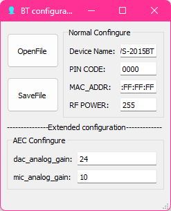

# Reverse Engineering of AC46/BT15 Part 4 : What's inside user.app?
Well, obviously, user.app contains main program, and other resources. So why I wrote this?<br>
Because there are something I should tell about.

## sdram.app
This is the main program of AC46 chipset, which controls the device. Usually it's the biggest file in the user.app, and it always sits on top of user.app.
An sdram.app and uboot.boot always start with `28 30 31 30 3A 30 08 E1` (looks like `010:0.á` in hex editor) and if those are encrypted by AC46 cipher, it looks like `(010:0)£`, as first 6 bytes are exposed.<br>

The strange thing about this file is that it is listed as offset of 0x1400 in resource file header, while sdram.app itself actually starts from 0.<br>
So in order to extract this file and other resource files, we have to substract 0x1400 from address listed in file header.

## ac46btcf.bin
This file stores configuration of Bluetooth and AEC.<br>
This file is also strange because it is stored not only in user.app but also outside of user.app, without a header.<br>
The configuration is stored in format below (C++ structure):
```
typedef struct _AC46BTCF {
    u16 CRC16;              // Excluding this field
    u16 Size;               // 0x31 (49) bytes
    char Name[32];
    char PIN[4];
    u8 MAC[6];
    u8 RFPower;
    u8 DACAnalogGain;       // AEC configure
    u8 MicAnalogGain;       // AEC configure
} AC46BTCF, *PAC46BTCF;
```
The configuration can be changed through GUI tool, which is included in AC46_BT_SDK, and may be able to update through BFU file.<br>


## eq_cfg.bin
Apparently this file stores EQ configuration, however I'm not sure about its format since I don't have a compatible version of AC46 EQ Tools.<br>
I tried pushing it to EQ Tools V2.0, but it said something in Chinese like "cannot read custom effect configurations".

## *.mp3
These files are obviously voice prompt that are played when something happened, like Bluetooth connection, a.k.a the famous "The Bluetooth device is connected uhh successfully." prompt.
So if you want to change the voice prompt, you have to replace these files.

## Other Resource Files
There may be UI related resource files like menu.res, ui_sty.sty, *.pix, *.tab. Those files are probably used for 128 * 64 display.<br>
Depending on project, there also may be another files like *.sbc, *.raw (.SBC is an audio file seen in new JieLi firmware, however it also exists in the AC46 SDK.).

## Resource Header and Resource File List
This is a resource header and file headers, like seen in the beginning of flash. Unlike flash header, it exists in very end of user.app.
For detail about those, see [SDFILE / SYDFS (by kagaimiq)](https://github.com/kagaimiq/jielie/blob/main/datafmt/sdfile.md).<br>
Obviously this file list stores all the resource files in user.app, however for some reason, as I mentioned earlier, all the resource files listed here have extra offset of 0x1400 in this list, while those actually don't.
There is also a problem that actual CRC of file list doesn't match the one listed in resource header (0x5EAD in this case).

```
6F 64 AD 5E 00 DE 0B 00 FD FF FF FF 22 00 00 00    |od.^.Þ..ýÿÿÿ"...|
00 00 00 00 00 00 00 01 98 00 F0 F0 0A 01 00 00    |........˜.ðð....|
00 00 10 29 00 14 00 00 D4 22 07 00 00 00 00 00    |...)....Ô"......|  <-Has extra offset of 0x1400, while it actually starts from 0
73 64 72 61 6D 2E 61 70 70 00 FF FF FF FF FF FF    |sdram.app.ÿÿÿÿÿÿ|
00 00 FB 85 00 38 07 00 31 00 00 00 01 00 00 00    |..û….8..1.......|
61 63 34 36 62 74 63 66 2E 62 69 6E 00 FF FF FF    |ac46btcf.bin.ÿÿÿ|
00 00 1F B6 00 3A 07 00 98 03 00 00 02 00 00 00    |...¶.:..˜.......|
65 71 5F 63 66 67 2E 62 69 6E 00 FF FF FF FF FF    |eq_cfg.bin.ÿÿÿÿÿ|
00 00 EA 35 00 3E 07 00 92 26 00 00 03 00 00 00    |..ê5.>..’&......|
6D 75 73 69 63 2E 6D 70 33 00 FF FF FF FF FF FF    |music.mp3.ÿÿÿÿÿÿ|
...

```

## _____.____1
This file is in fact outside of user.app, however the encryption of user.app seems to continue to the end of this file (If user.app is double-encrypted, this is also double-encrypted).
By decrypting it along with user.app, we can observe 0x6C (108) bytes of something, which I'm still not sure about it, however it seems to be equivalent to sys.cfg which is seen in AC69 firmware.
```
14 40 D8 00 00 00 10 00 00 98 0C 00 00 F2 0B 00    |.@Ø......˜...ò..|
0A A1 00 00 00 00 00 00 00 9E 00 00 00 1C 00 00    |.¡.......ž......|
00 A0 00 00 00 10 00 00 00 00 00 00 00 00 00 00    |. ..............|
00 00 00 00 00 00 00 00 00 00 00 00 00 00 00 00    |................|
00 00 00 00 00 00 00 00 00 00 00 00 00 00 00 00    |................|
00 00 00 00 00 00 00 00 00 00 00 00 00 36 6E 01    |.............6n.|
00 00 00 00 01 00 00 00 01 00 00 00                |............    |
(Encryption of user.app ends here)
```
