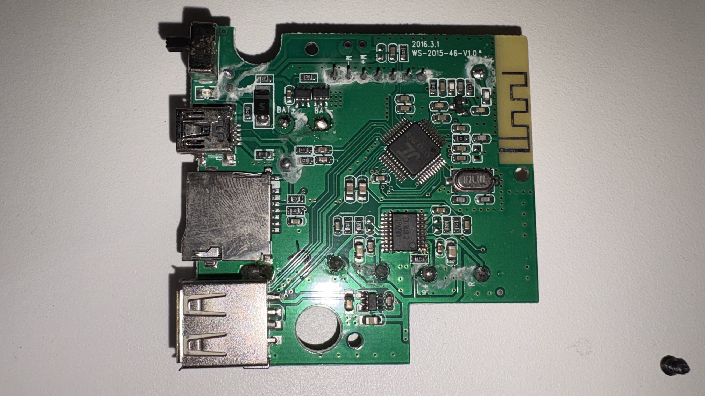
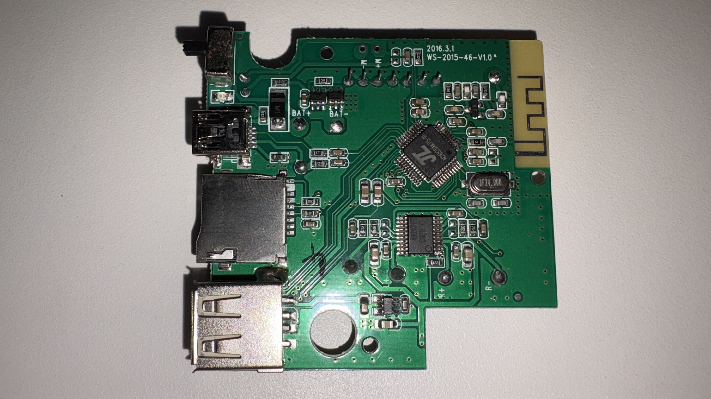
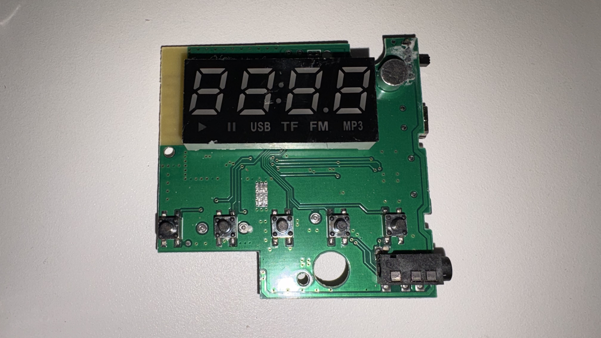
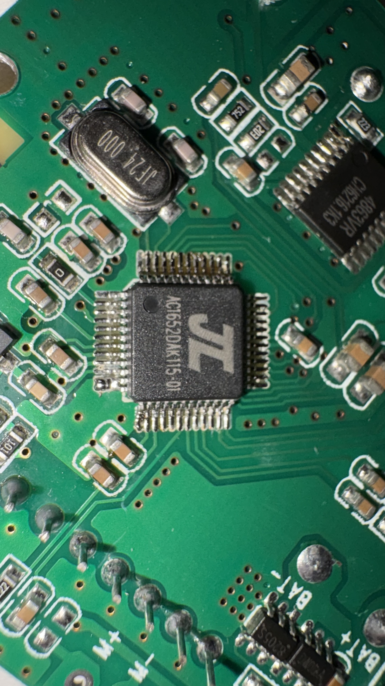
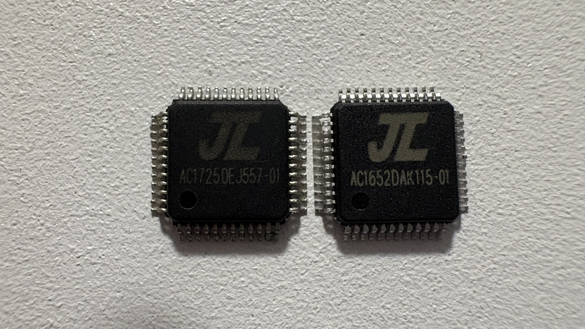

# Wster WS-2015

Main MCU: AC4601 
[Download Original Firmware](WS2015Flash.bin) 
[Contents of Firmware](WS2015Flash.bin_Contents/)

This was a hard-bricked device, but now it have replaced its microcontroller and flashed a modified firmware. 

 
 

Before relpacing (Fingerprints aren't mine!) 
 
After replacing 
 
Front 
 
New MCU 
 
Left: Old  Right: New 

