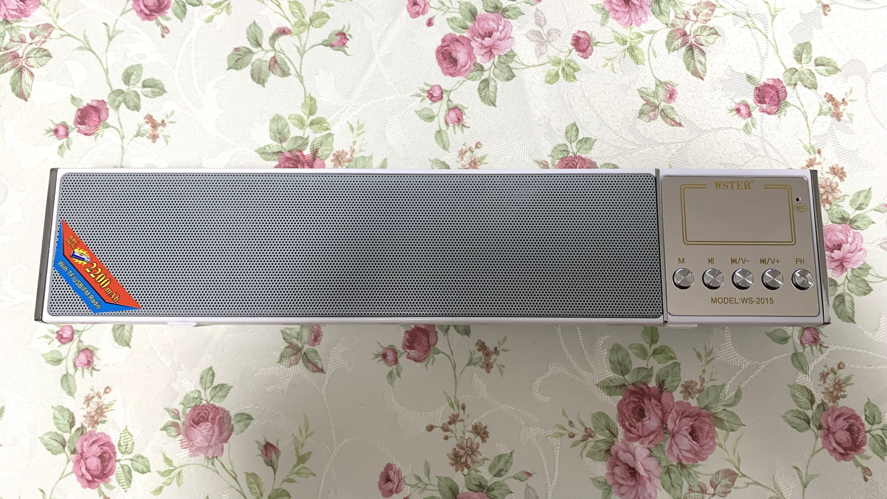

# Wster WS-2015

Main MCU: AC4601 
[Download Original Firmware](WS2015Flash.bin) 
[Contents of Firmware](WS2015Flash.bin_Contents/)

This is the hard-bricked one, I have one more identical device which is fine. 
Since I've successfully unpacked its firmware, I will replace the MCU and try to flash a modified firmware. 

 
 
